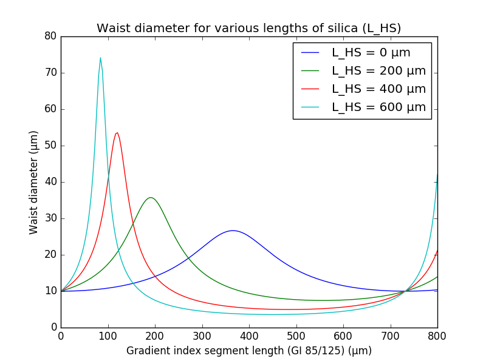

GradissimoCalculator
====================

Python code for the calculation of Gaussian beams and application to Gradissimo fibers.

The geometry of a Gradissimo fiber is the following:

          input_fiber    HS       GI         OUT
        _________________________________
        _____________          |         |         
                     |  L_HS   |  L_GI   |   L_OUT |   
        -------------          |         |       
        ---------------------------------
                     Q0        Q1        Q2       Q3

* HS = Homogeneous Space, typically a silica fiber with no core
* GI = Gradient Index Fiber
* OUT = Output Space, typically air

--
As an example, file `EX1_Plots.py` reproduces figures 5 and 6 from [this reference][1].

[1]: https://www.osapublishing.org/jlt/abstract.cfm?uri=jlt-17-5-924

-- 
The project can be downloaded with `git clone git://github.com/ocastany/GradissimoCalculator.git`.
The directory `GradissimoCalculator/gradissimo` should be included in the Python module search path for an easy import.

--
Copyright (C) 2020 Olivier Castany

This program is free software: you can redistribute it and/or modify
it under the terms of the GNU General Public License as published by
the Free Software Foundation, either version 3 of the License, or
(at your option) any later version.

This program is distributed in the hope that it will be useful,
but WITHOUT ANY WARRANTY; without even the implied warranty of
MERCHANTABILITY or FITNESS FOR A PARTICULAR PURPOSE.  See the
GNU General Public License for more details.

A copy of the GNU General Public License is available in the LICENCE file.

